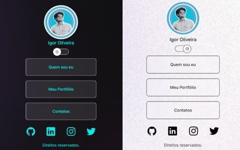

<h1 align="center"> My Profile </h1>

 

  

## 🚀 Tecnologias

Esse projeto foi desenvolvido com as seguintes tecnologias:

- HTML e CSS
- JavaScript
- Git e Github
- Figma

## 💻 Projeto

O MyProfile é usado como cartão de visitas online.

- [Acesse o projeto finalizado, online] <a href="https://igorenatoo.github.io/MyProfile/" target="_blank">Link - MyProfile</a>

## 🔖 Layout

Você pode visualizar o layout do projeto através [DESSE LINK](https://www.figma.com/community/file/1187422022288947321). É necessário ter conta no [Figma](https://figma.com) para acessá-lo.

## :memo: Licença.

Esse projeto está sob a licença MIT. Muito café e muito bug! :)
