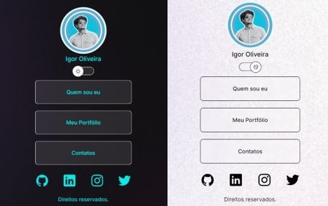

# My Profile

## 💻 Descrição do projeto

O **My Profile** é um cartão de visitas online que permite que usuários compartilhem suas informações de contato e portfólio de forma fácil e acessível. O objetivo é criar uma presença online que possa ser usada em redes sociais ou para networking.

> **Colaboração:** Not found  
> **Status:**  Concluído  ✔️

  
 👀 Prévia 

  

## 📜 Índice

- [Descrição](#-descrição-do-projeto)
- [Conceitos Aprendidos](#-conceitos-aprendidos)
- [Tecnologias Utilizadas](#--tecnologias-utilizadas)
- [Instalação](#-instalação)
- [Uso](#-uso)
- [Funcionalidades](#-funcionalidades)
- [Pendências](#-pendências)
- [Contribuição](#-contribuição)
- [Informações Adicionais](#-informações-adicionais)
- [Licença](#-licença)
- [Conclusão](#-conclusão)

## ✅ Conceitos Aprendidos 

- Desenvolvimento de cartões de visita online.
- Utilização de HTML e CSS para estilização.
- Implementação de JavaScript para interatividade.
- Controle de versão com Git e gerenciamento no GitHub.
- Design de interface no Figma.

## 🛠 Tecnologias Utilizadas

## ⚙ Instalação

Para começar a usar este projeto, siga as etapas abaixo:

1. Faça um fork do repositório:
   <pre>git fork https://github.com/IgoRenatoo/MyProfile.git</pre>

2. Clone o seu fork para sua máquina:
   <pre>git clone https://github.com/IgoRenatoo/MyProfile.git</pre>

3. Acesse o diretório do projeto:
   <pre>cd MyProfile</pre>

4. Execute o projeto:
   <pre>code .</pre>

## 🚀 Uso 

Para usar o projeto, basta abrir o arquivo `index.html` no seu navegador. Você verá o cartão de visitas com as informações que você deseja compartilhar.

## 🧩 Funcionalidades

1. **Exibição de Informações Pessoais**
   - O cartão exibe seu nome, foto e uma breve descrição sobre você.

2. **Links para Redes Sociais**
   - Links para suas redes sociais estão disponíveis para fácil acesso.

3. **Interatividade**
   - O projeto inclui interações simples usando JavaScript para melhorar a experiência do usuário.

## ⏳ Pendências

[x] Desenvolver a parte de Projetos. Concluído. ✔️

## 🤝 Contribuição

1. Faça um fork deste repositório.
2. Clone o seu fork para sua máquina ( `git clone https://github.com/user_name/MyProfile` ).
3. Crie uma branch para sua feature ou correção de bug ( `git checkout -b <nome-da-nova-ramificacao>` ).
4. Commit suas alterações ( `git commit -m 'Mensagem desejada'` ).
5. Push para a branch ( `git push origin <nome-da-branch-criada>` ).
6. Abra um Pull Request.
7. Aguarde à análise.

## 💡 Informações adicionais

- O projeto foi inspirado por uma necessidade pessoal de ter um cartão de visitas online.
- O design foi elaborado no Figma, permitindo ajustes fáceis na interface.
- Este projeto pode ser expandido para incluir funcionalidades adicionais, como formulários de contato.

## 🔓 Licença

Este projeto está licenciado sob a Licença MIT.

## 🏁 CONCLUSÃO

O projeto **My Profile** foi uma ótima oportunidade para aplicar conceitos de desenvolvimento web, incluindo HTML, CSS e JavaScript. Aprendi a trabalhar com Git e a criar um design responsivo que pode ser facilmente compartilhado online.

💻 "Por que os programadores preferem escuro? Porque a luz atrai bugs!" 🐞
